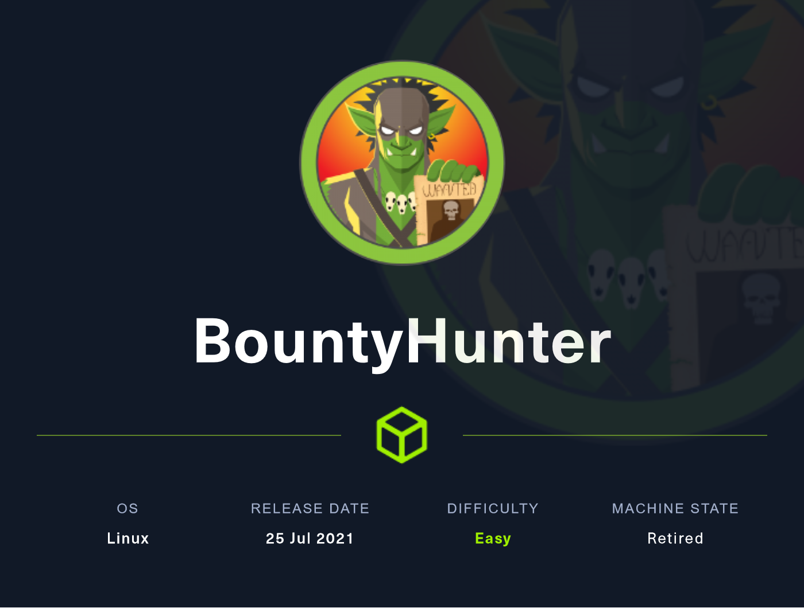
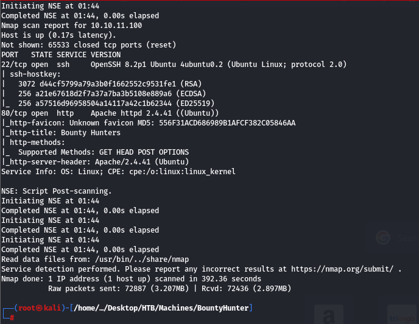
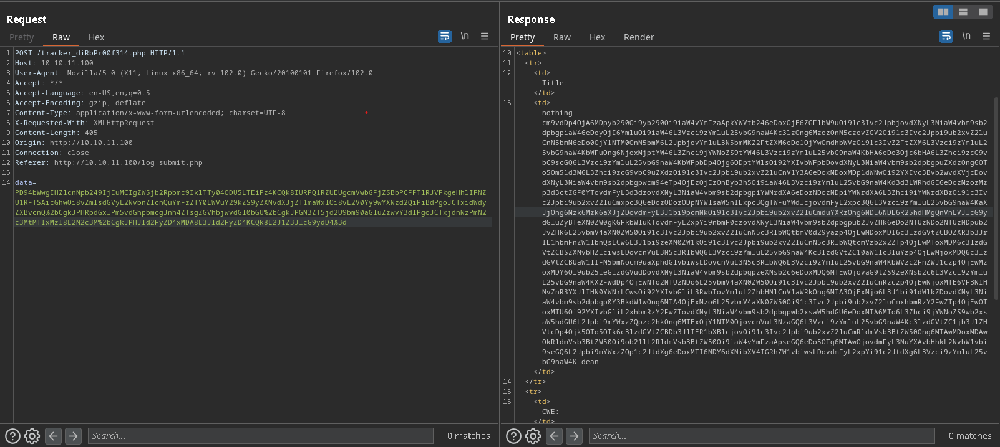
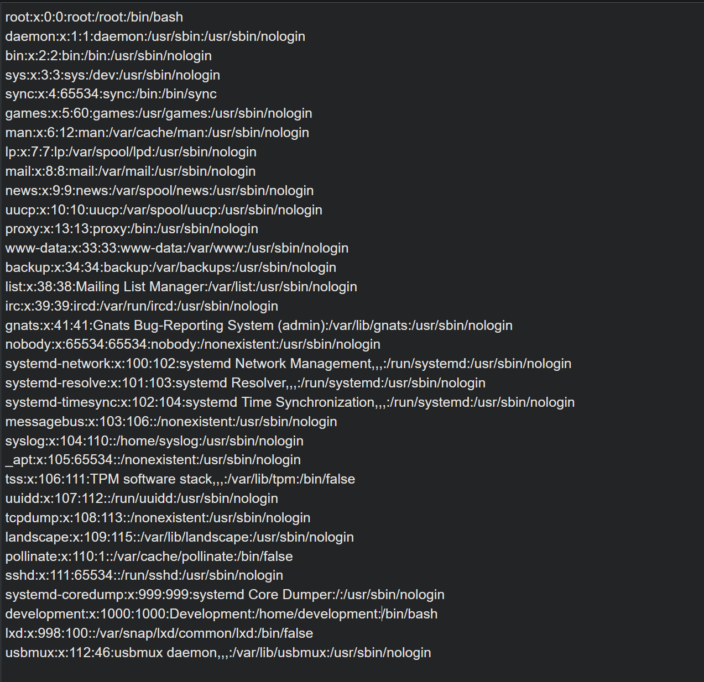
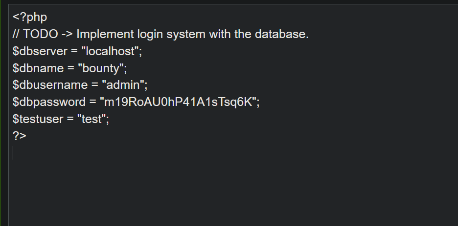
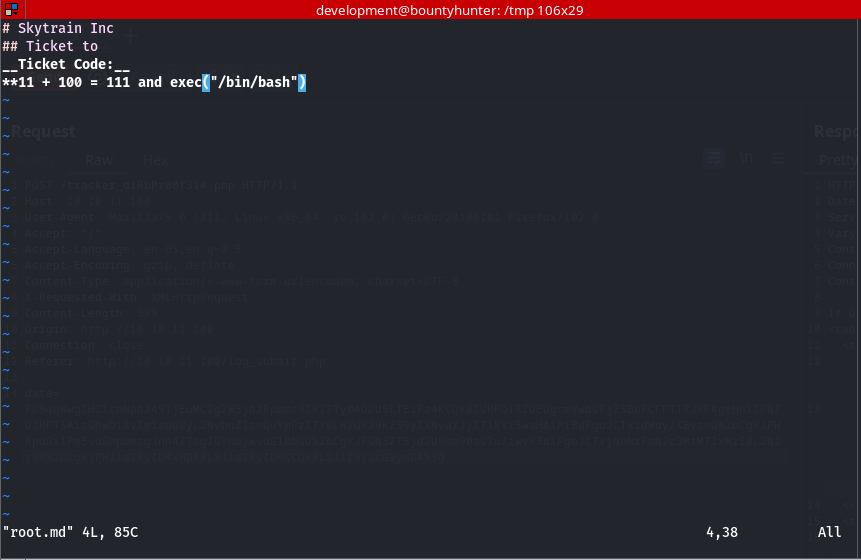
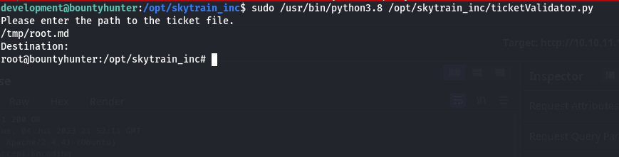
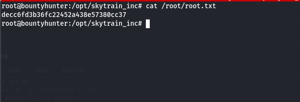

# Bounty Hunter - Hack the Box Writeup

In this Hack the Box writeup, we will walk through the process of hacking into the **Bounty Hunter machine**. This machine requires a mix of web application exploitation and privilege escalation techniques. The first step is to perform a port scan and identify the open ports and services. From there, we will exploit a vulnerability in the web application to gain access to the machine. Finally, we will escalate our privileges to gain root access and complete the challenge.



## **Initial Reconnaissance**

The first step in the process is to perform a port scan using Nmap to identify the open ports and services. This will help us understand the attack surface and identify potential vulnerabilities to exploit.

```bash
nmap -sC -sV -v -T4 -p- -oA nmap/bountyhunter 10.10.11.100
```

After the Nmap scan we get 2 ports open which are **ssh(22) and http(80).**



Heading over to this → [http://10.10.11.100/](http://10.10.11.100/) opens up this webpage.


After enumerating the webpage further, I found only this [http://10.10.11.100/portal.php](http://10.10.11.100/portal.php) webpage, which says “Portal under development. Go here to test the bounty tracker.”


Which is further redirecting us to this [http://10.10.11.100/log_submit.php](http://10.10.11.100/log_submit.php), and opens up this page.

After filling the given fields, and submitting it. It returns this output.


I captured the following request in burp. Which then reveals a secret page in the webserver → [http://10.10.11.100/tracker_diRbPr00f314.php](http://10.10.11.100/tracker_diRbPr00f314.php), and also the data parameter in the request is base 64 encoded, decoding it base64 reveals that it is an XML request is being POSTED to the server.


So here we can try using the XXE injection, cause there may be a XXE vulnerability.

But before that let’s just enumerate the webpage further by fuzzing it. I have used feroxbuster to fuzz the webpage, you can use any tool you may like.

```bash
feroxbuster -u http://10.10.11.100/ -w /usr/share/wordlists/seclists/Discovery/Web-Content/directory-list-2.3-medium.txt -x php -C 40
```


The feroxbuster’s output reveals an interesting php page in the webserver which is db.php, visiting it opens up a blank page.

## **Exploitation**

Now moving forward with our XML page which we found earlier, I tried using the XXE injection against it from [Payload All The Things](https://github.com/swisskyrepo/PayloadsAllTheThings/tree/master/XXE%20Injection).

```xml
<?xml  version="1.0" encoding="ISO-8859-1"?>
    <!DOCTYPE replace [<!ENTITY xxe SYSTEM "php://filter/convert.base64-encode/resource=file:///etc/passwd"> ]>
    <bugreport>
    <title>nothing &xxe; dean</title>
    <cwe>cwe=nothing</cwe>
    <cvss>cvss-12132</cvss>
    <reward>100</reward>
    </bugreport>
```

I base64 encode the above payload and then URL encoded it. Now using burp to send this request.



The sent request returns us this response with a base64 encoded string in it. Decoding it with base64 reveals the contents of /etc/passwd file on the server.



This reveals the user “development” on the box.

Now I tried a lot to upload a reverse shell to the box but its of no use, I couldn’t find any way to do so.

Then I remembered I found a db.php file on the web server. I tried sending that file.

```xml
<?xml  version="1.0" encoding="ISO-8859-1"?>
    <!DOCTYPE replace [<!ENTITY xxe SYSTEM "php://filter/convert.base64-encode/resource=db.php"> ]>
    <bugreport>
    <title>nothing &xxe; dean</title>
    <cwe>cwe=nothing</cwe>
    <cvss>cvss-12132</cvss>
    <reward>100</reward>
    </bugreport>
```

Again base64 and URL encoding the above payload and sending it. Reveals clear text credentials of “admin” user.



I tried SSHing in the box with user “admin” and its pass. But it doesn’t seem to work.

## **Shell as development**

Then I tried the same password with the user “development” which validates us and gives us a shell.

Simply listing the files in the default directory reveals the user.txt.


## Privilege Escalation

Now for the privesc part I tried listing files that can be ran with root permissions.

Reveals us this python [ticketvalidator.py](http://ticketvalidator.py) file.


After reading and analyzing the python code, I found that the [ticketvalidator.py](http://ticketvalidator.py) file only accepts the .md files and denies any other file. It also checks what is written inside of the file with proper syntax of how a ticket is created.

The first line of every ticket should contain → # Skytrain Inc

second line should contain → ## Ticket to

third line should contain → **Ticket Code:**_

The fourth line should contain two digits separated by a ‘+’ symbol returning a sum, and where the number before ‘+’ symbol should be divisible by 7 and returning 4 as the remainder.

Fulfilling the above criteria I created a script in the temp directory named [root.md](http://root.md). And also added an extra line stating the shell, which is true. This is script is being executed with root permissions which can give us a root shell.



```bash
sudo /usr/bin/python3.8 /opt/skytrain_inc/ticketValidator.py
```



Yeah!!! and like that we are root!!!.

Now moving forward and grabbing the root.txt.



THANKS GUYS FOR READING!

HOPE U LIKE IT!

HAPPY HACKING!!!
